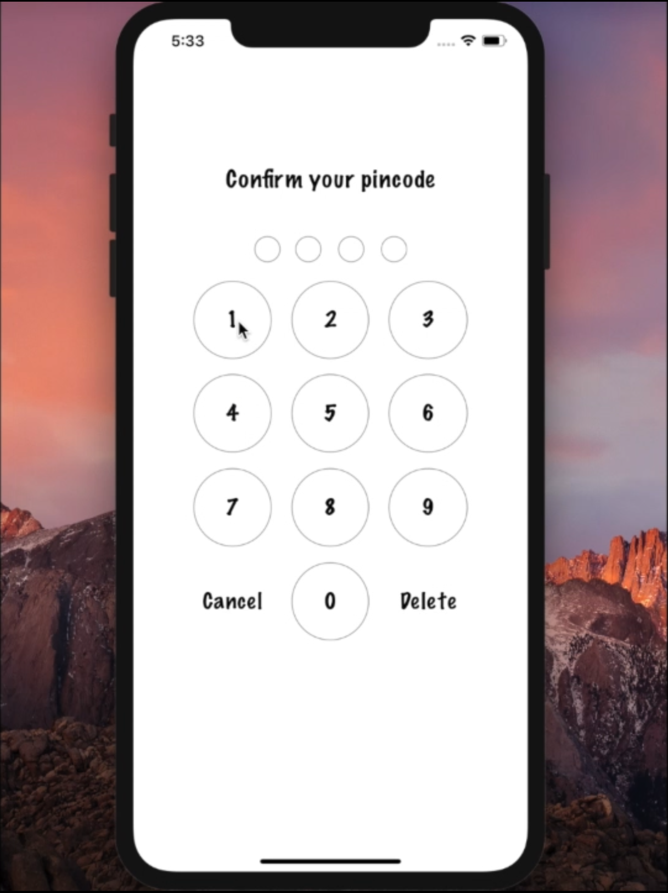
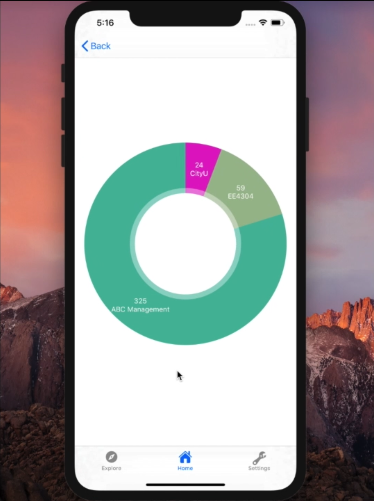
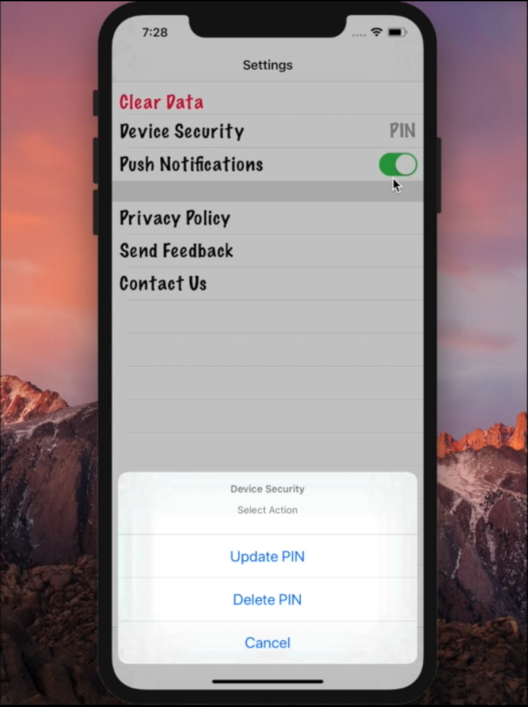
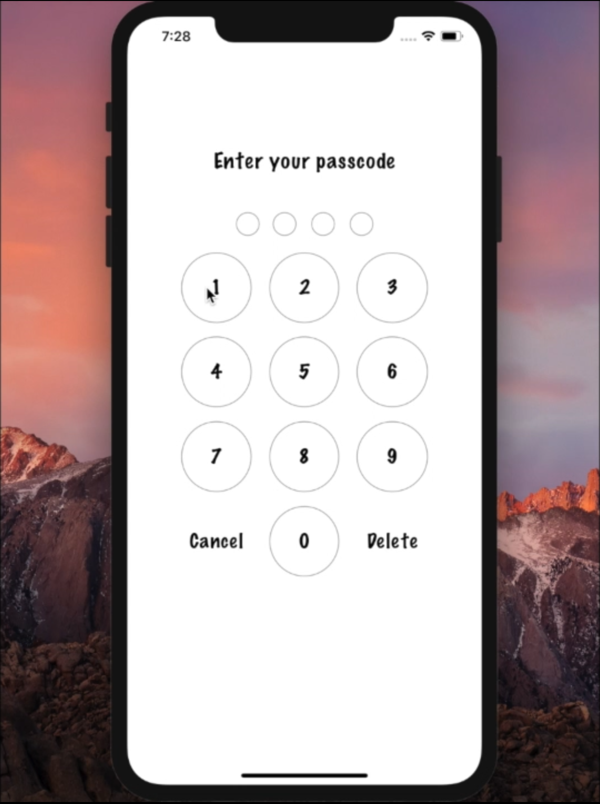
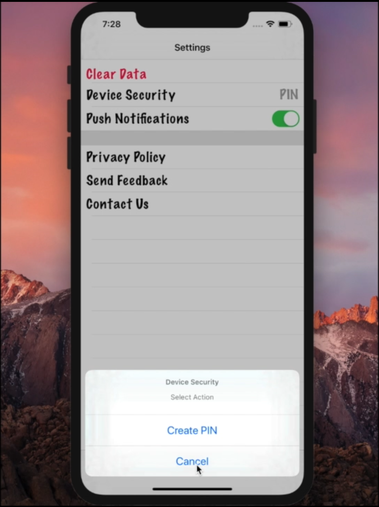

# MPF_Demo
Group Project

このプロジェクトの全体はZIPファイルですが、私が担当した部分のコードを単独でアップロードしました。
このIOSアプリです。

【Passcode.swift】
個人情報保護するため、アプリを起動すると、パスワード入力画面になります。
初めて起動する際、パスワードを2回入力して設定します。
 <picture>
  
</picture>
<picture>
  
</picture>

【ChartViewModel.swift、SummaryViewController.swift】
持ち口座を円グラフで可視化するモデルと画面のコントローラーです。
 <picture>
  
</picture>

【SettingViewModel.swift】
アプリ内のデータを削除するモデルです。
 1.<picture>
  
</picture>
 2.<picture>
  
</picture>
 3.<picture>
  
</picture>
